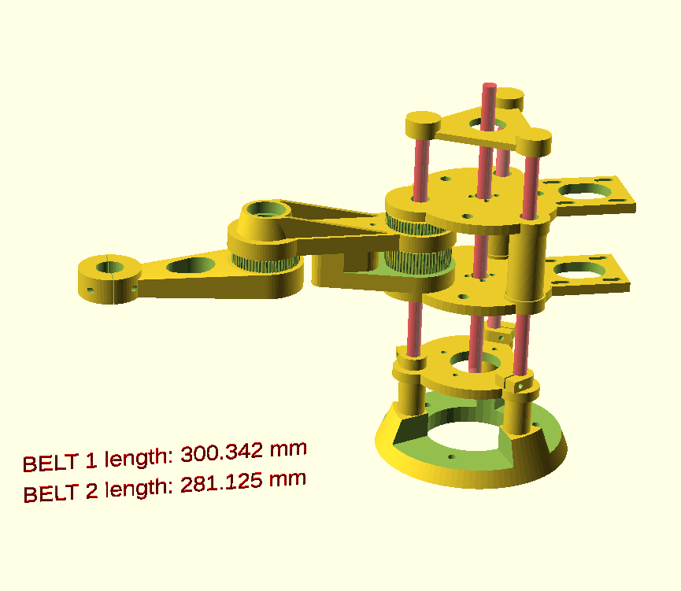
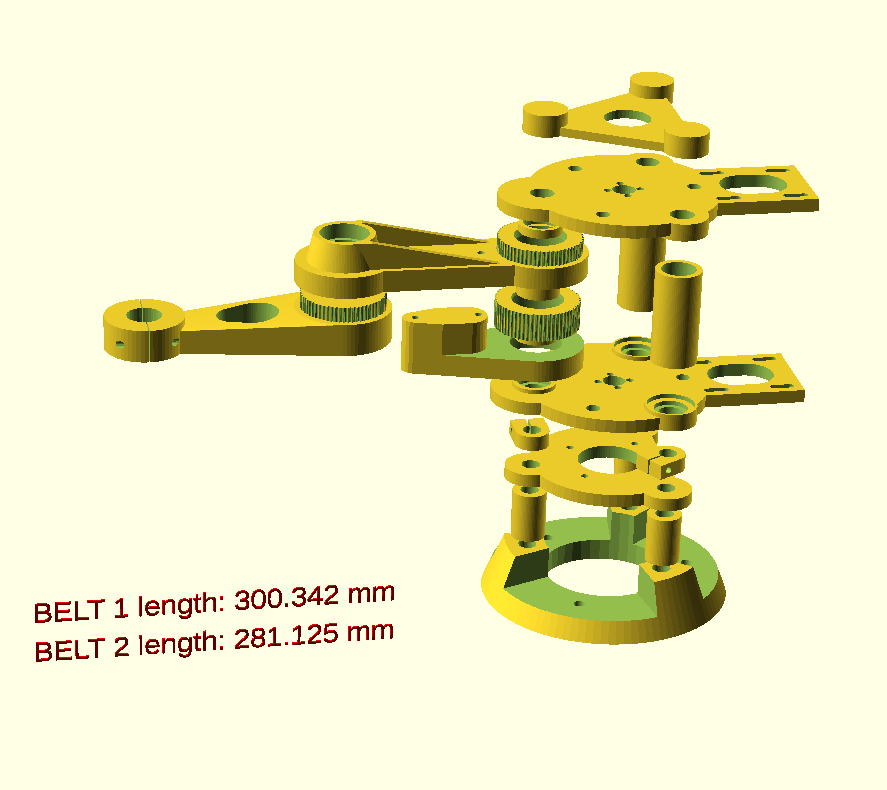

# SCARA Robotic Arm

This is my take for an SCARA Robotic Arm, I've used this project to learn OpenSCAD mainly. At the very end are the real authors of this arm.

### Testing movement with a Ramps 1.4v
  

> Checkout the `gallery` dir for more pics 
--- 

This source is a fork of:
[Parametrized SCARA robotic arm. Customizable](http://www.thingiverse.com/thing:3207936) by [Kalium](https://www.thingiverse.com/Kalium/about)  
[Creative Commons - Attribution license](http://creativecommons.org/licenses/by/3.0/)

Which is a remix of:
[Scara robotic arm](http://www.thingiverse.com/thing:1241491) by [Idegraaf](https://www.thingiverse.com/Idegraaf/about)  
[Creative Commons - Attribution - Share Alike license](http://creativecommons.org/licenses/by-sa/3.0/)

## How to
* `settings.scad` are all the user constants to change
* `index.scad` contains the entire thing assembled (there is a boolean too for separation of pcs)
* `exporter.scad` is an utility file to export each STL pc

The idea is to open index.scad and update settings.scad with your values, when is ready, just open the exporter.scad (which uses same settings) and export the parts you need
